

    

  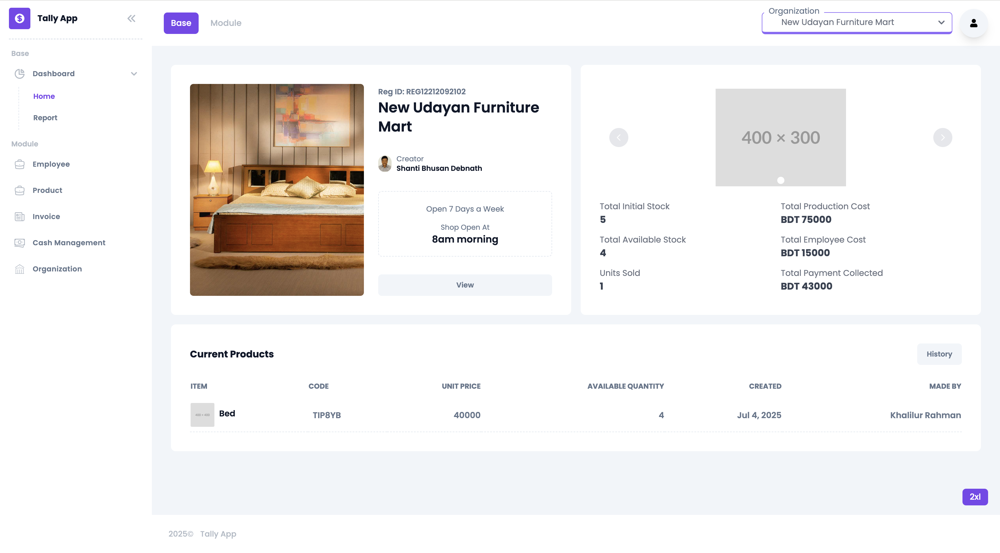
  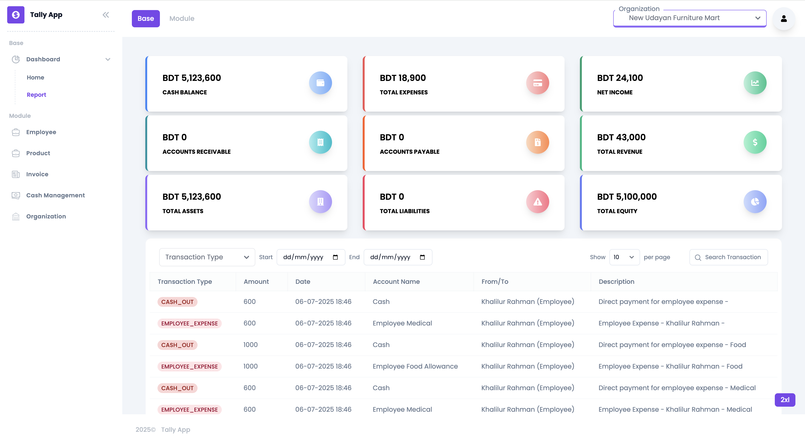
  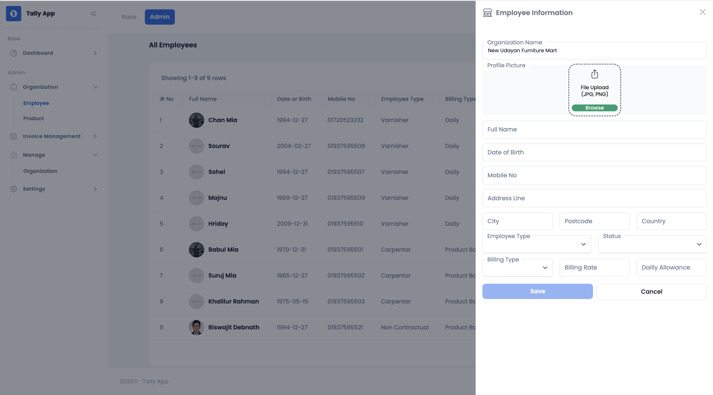
  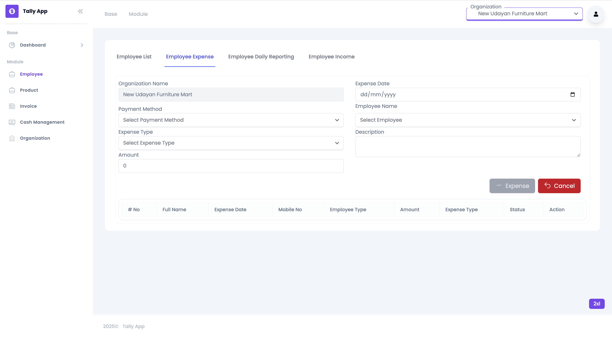
    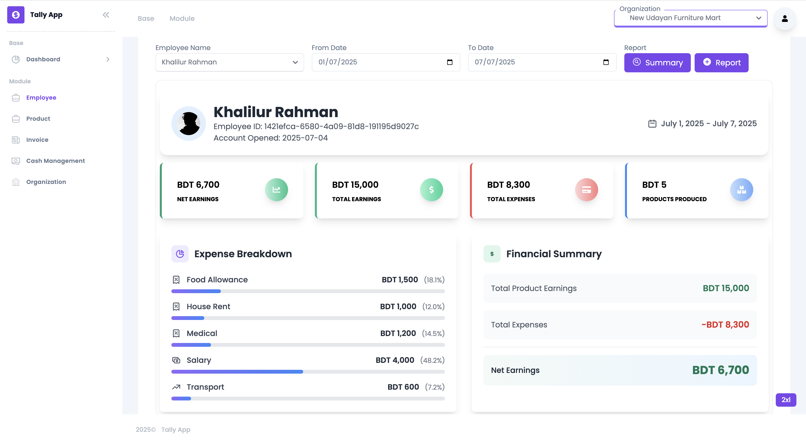
  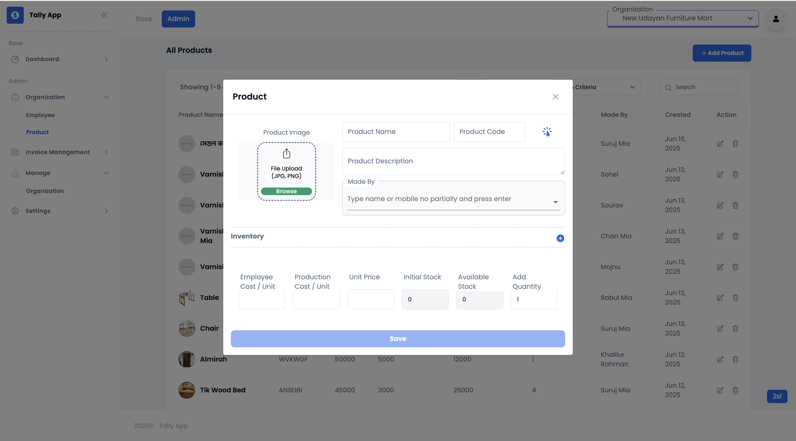
  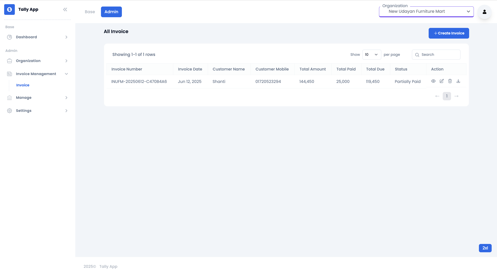
  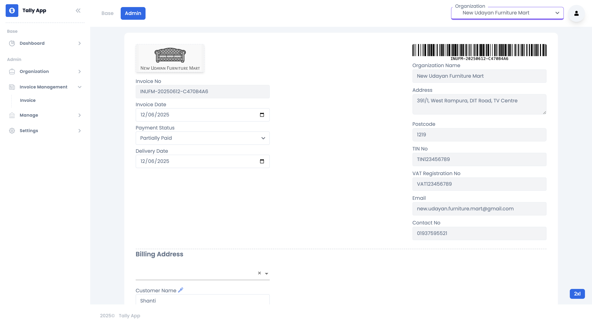
  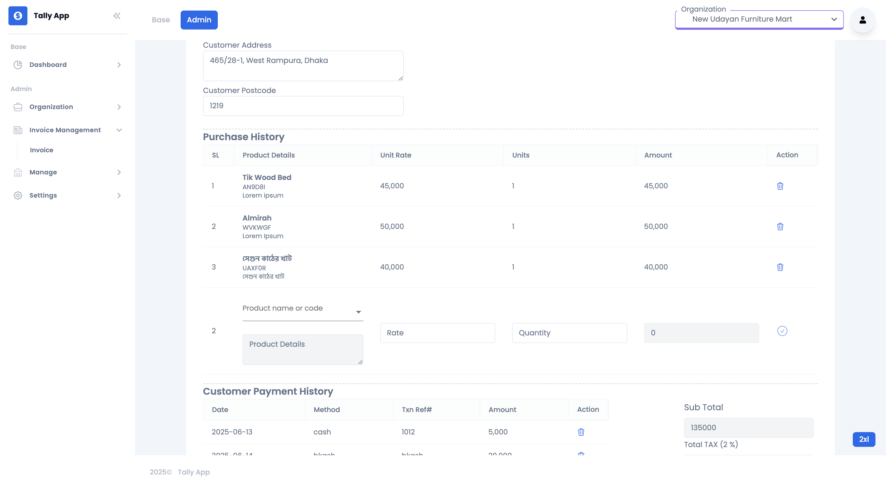
  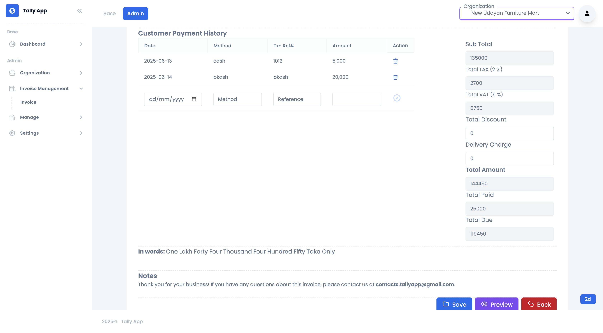
  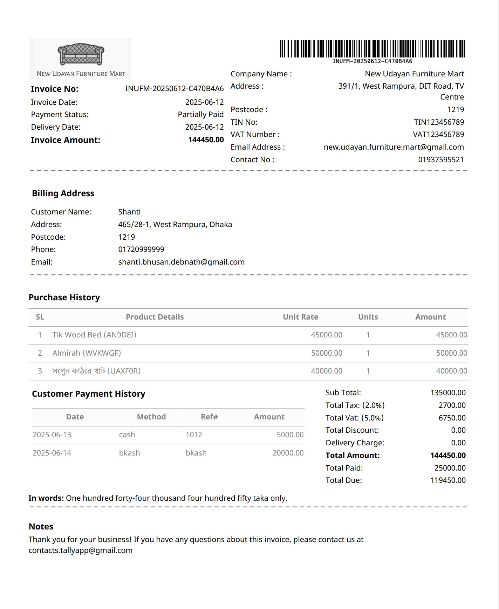
  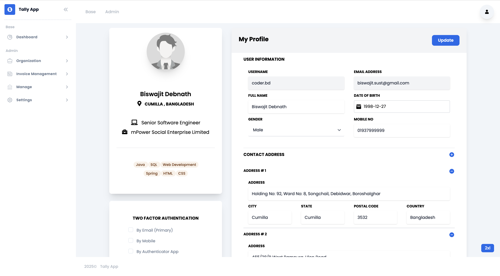
  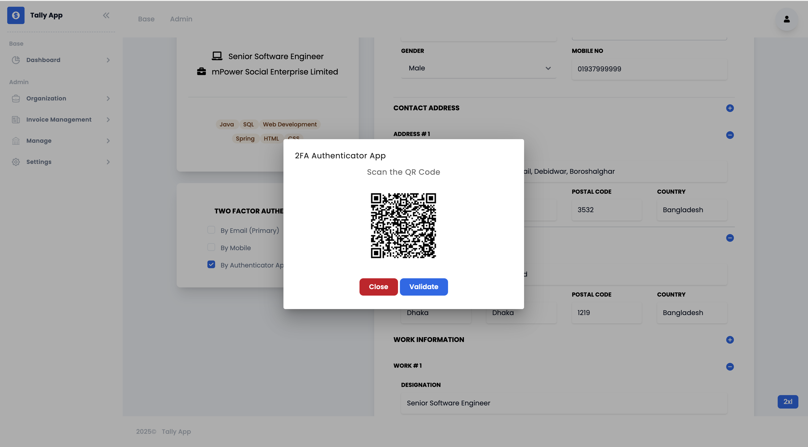
  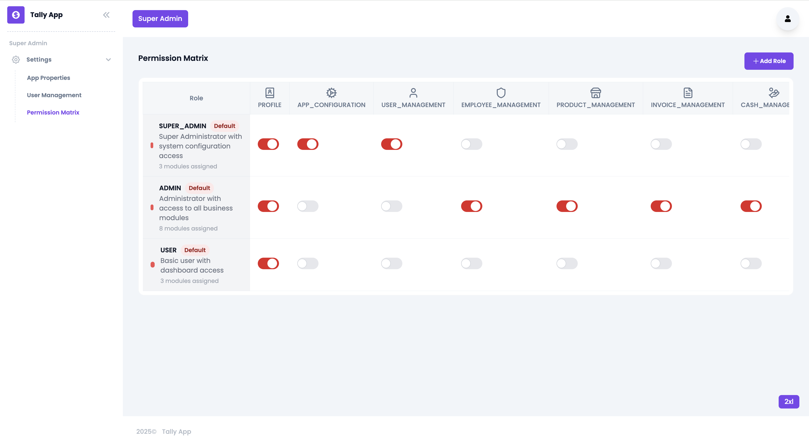
  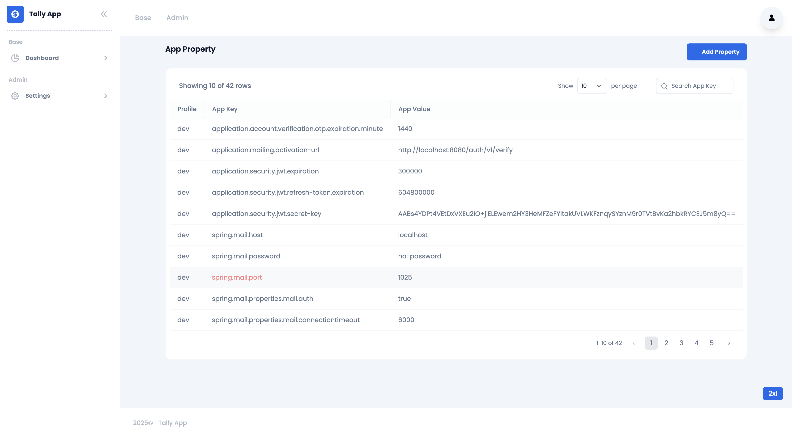

#### Versions

 

#### Features

- [x] Sidebar
- [x] Navbar
- [x] Footer
- [x] Auth Module 
    - Sign In
    - Sign Up
    - Forgot Password,
    - Login By 2FA Authentication (Email or Authenticator App)
- [x] Auth Guards
- [x] Dashboard Module
- [x] Create Organization
- [x] Create Employee under an Organization
- [x] Create Product for an Organization
- [x] Create Invoice using Product
- [x] Modify App Property
- [x] User Management
- [x] Module Based Security
- [x] Cash Management
- [x] Organization Income
- [x] Reporting
- [ ] Employee Income
- [ ] Translate App

#### Commands

| command                   | What it does?                                 |
| ------------------------- | :-------------------------------------------- |
| `npm start`               | Starts the server in dev mode                 |
| `npm run lint`            | Runs ESLint on project                        |
| `npm run prettier`        | Runs prettier on entire src folder            |
| `npm run prettier:verify` | Runs prettier-check and throws error if fails |
| `npm run prettier:staged` | Runs prettier on only staged (changed) files  |
| `npm run test:e2e`        | Runs playwright e2e test with UI              |

#### Dependencies

| Package            | What it does?                                                                               | Link                                                   |
| ------------------ | :------------------------------------------------------------------------------------------ | :----------------------------------------------------- |
| `angular-svg-icon` | Provides a means to inline SVG files to allow for them to be easily styled by CSS and code. | [Here](https://www.npmjs.com/package/angular-svg-icon) |
| `apexcharts`       | Modern & Interactive Open-source Charts                                                     | [Here](https://www.npmjs.com/package/apexcharts)       |
| `ng-apexcharts`    | Angular wrapper for ApexCharts to build interactive visualizations in Angular.              | [Here](https://www.npmjs.com/package/ng-apexcharts)    |

#### Dev Dependencies

| Package                       | What it does?                                                                                            | Link                                                              |
| ----------------------------- | :------------------------------------------------------------------------------------------------------- | :---------------------------------------------------------------- |
| `prettier`                    | An opinionated code formatter                                                                            | [Here](https://www.npmjs.com/package/prettier)                    |
| `prettier-plugin-tailwindcss` | A Prettier plugin for Tailwind CSS that automatically sorts classes based on our recommended class order | [Here](https://www.npmjs.com/package/prettier-plugin-tailwindcss) |
| `tailwind-scrollbar`          | Tailwind plugin for styling scrollbars.                                                                  | [Here](https://www.npmjs.com/package/tailwind-scrollbar)          |
| `tailwindcss`                 | A utility-first CSS framework for rapidly building custom user interfaces.                               | [Here](https://www.npmjs.com/package/tailwindcss)                 |

#### Icons and Patterns

This project use [Hero Icons](https://heroicons.com/) , [Hero Patterns](https://heropatterns.com/) and [Popsys illustrations](https://popsy.co/)

#### Disclaimer

The Tailwind name and logos are trademarks of Tailwind Labs Inc.
The Angular name and logos are trademarks of Google.
